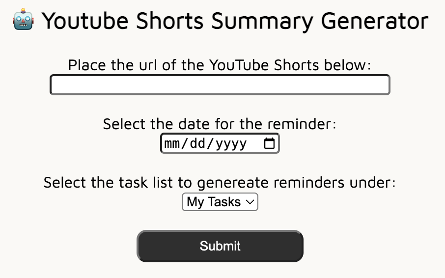

# arc
arc is a video-to-text AI summarization tool for short-form videos.

## Setup
The application requires 4 things: (1) Google Cloud OAuth CLIENT_ID, CLIENT_SECRET, and PROJECT_ID (2) OpenAI API key. 

First, you will need to configure Google API and set the scope for the API. Please follow the [documentation](https://developers.google.com/people/quickstart/python) to generate credentials needed to run the app.

Second, generate the OpenAI API key from [here](https://platform.openai.com/api-keys).

Build the docker image locally:
```bash
docker build -t arc-build . --no-cache
```
or pull the Docker image from the Docker Hub:
```bash
docker pull yoenoo/arc-build:latest
```

Run the web application by running the command below or using [Docker secret](https://docs.docker.com/engine/swarm/secrets/):
```bash
docker run -d -p 8000:8000 \
  -e CLIENT_ID \
  -e CLIENT_SECRET \
  -e PROJECT_ID \
  -e OPENAI_API_KEY \ 
  arc-build
```

Before running the app, make sure you add the url of the app as the <b>Authorized redirect URIs</b> to avoid "Error 400: redirect URI mismatched" error. For more details, please refer to [this](https://www.googlecloudcommunity.com/gc/Developer-Tools/Getting-error-redirect-uri-mismatch-when-using-oAuth/m-p/608233) and [this](https://stackoverflow.com/questions/11485271/google-oauth-2-authorization-error-redirect-uri-mismatch).

## Demo
<p align="center">
  
</p>

For the full video explanation, please watch our demo: [YouTube Demo](https://youtu.be/1iQ9Bt31_5w)

## TODO
- [ ] cache results to avoid redundant OpenAI API calls
- [ ] chrome extension 
